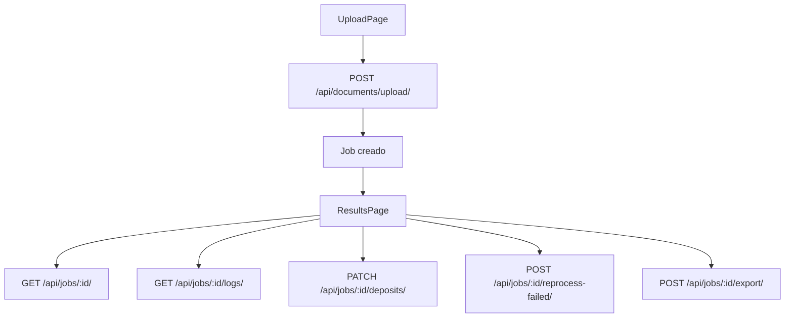

# Integración frontend-backend

## Matriz de consumo

| Archivo frontend | Función cliente | Método | Endpoint | Vista esperada | Auth/header | Estado |
| --- | --- | --- | --- | --- | --- | --- |
| `src/features/processing/api/processing.api.ts` | `uploadDocument` | `POST` | `/api/documents/upload/` | `DocumentUploadView` | `X-API-Key` | Canónico |
| `src/features/processing/api/processing.api.ts` | `processJob` | `POST` | `/api/jobs/:id/process/` | `JobProcessView` | `X-API-Key` | Canónico |
| `src/features/processing/api/processing.api.ts` | `deleteJob` | `DELETE` | `/api/jobs/:id/` | `JobDetailView` | `X-API-Key` | Canónico |
| `src/features/processing/api/processing.api.ts` | `saveJobCorrections` | `PATCH` | `/api/jobs/:id/deposits/` | `JobDepositsBulkUpdateView` | `X-API-Key` | Canónico |
| `src/features/processing/api/processing.api.ts` | `reprocessDeposit` | `POST` | `/api/jobs/:id/deposits/:depositId/reprocess/` | `JobDepositReprocessView` | `X-API-Key` | Canónico |
| `src/features/processing/api/processing.api.ts` | `reprocessFailed` | `POST` | `/api/jobs/:id/reprocess-failed/` | `JobReprocessFailedView` | `X-API-Key` | Canónico |
| `src/features/processing/api/processing.api.ts` | `reprocessSourceImage` | `POST` | `/api/jobs/:id/source-images/:sourceImageId/reprocess/` | `JobSourceImageReprocessView` | `X-API-Key` | Canónico |
| `src/features/processing/api/processing.api.ts` | `getJob` | `GET` | `/api/jobs/:id/` | `JobDetailView` | `X-API-Key` | Canónico |
| `src/features/processing/api/processing.api.ts` | `listJobs` | `GET` | `/api/jobs/` | `JobListView` | `X-API-Key` | Canónico |
| `src/features/processing/api/processing.api.ts` | `exportJob` | `POST` | `/api/jobs/:id/export/` | `JobExportView` | `X-API-Key` | Canónico |
| `src/features/processing/api/processing.api.ts` | `getJobLogs` | `GET` | `/api/jobs/:id/logs/` | `JobLogsView` | `X-API-Key` | Canónico |
| `src/features/processing/api/processing.api.ts` | `getJobDiagnostics` | `GET` | `/api/jobs/:id/diagnostics/` | `JobDiagnosticsView` | `X-API-Key` | Canónico |
| `src/features/processing/api/processing.api.ts` | `getProcessingState` | `GET` | `/api/jobs/:id/processing-state/` | `JobProcessingStateView` | `X-API-Key` | Canónico |
| `src/features/settings/api/settings.api.ts` | `getProcessingSettings` | `GET` | `/api/processing/settings/` | `ProcessingSettingsView` | `X-API-Key` | Canónico |
| `src/features/settings/api/settings.api.ts` | `updateProcessingSettings` | `PATCH` | `/api/processing/settings/` | `ProcessingSettingsView` | `X-API-Key` | Canónico |
| `src/features/settings/api/settings.api.ts` | `getProcessingSettingsOptions` | `GET` | `/api/processing/settings/options/` | `ProcessingSettingsOptionsView` | `X-API-Key` | Canónico |
| `src/features/settings/api/settings.api.ts` | `getOllamaModels` | `GET` | `/api/processing/ollama/models/` | `OllamaModelsView` | `X-API-Key` | Canónico |
| `src/features/assistant/api/assistant.api.ts` | `sendAssistantChat` | `POST` | `/api/assistant/chat/` | `AssistantChatView` | `X-API-Key` | Canónico |

## Flujo completo

## Estados de procesamiento

- `uploaded`
- `processing`
- `completed`
- `completed_with_errors`
- `failed`

## Checklist local

1. Levantar backend en `http://localhost:8000`.
2. Levantar frontend en `http://localhost:5173`.
3. Confirmar `VITE_API_BASE_URL=http://localhost:8000/api`.
4. Confirmar `VITE_API_KEY` si la API la exige.
5. Validar `CORS_ALLOWED_ORIGINS` y `CSRF_TRUSTED_ORIGINS` del backend.
6. Subir un DOCX y revisar que el job avance.

## Errores comunes

- API base URL incorrecta.
- API key faltante o distinta.
- CORS bloqueando el navegador.
- CSRF desalineado en entornos con cookies.
- Backend caído o timeout de OCR/LLM.
- Mismatch de payload al corregir depósitos.
