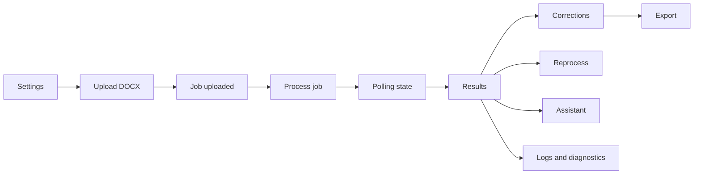

# Flujo de procesamiento en la UI

## Propósito

Explicar cómo la SPA coordina carga, configuración, procesamiento, revisión,
correcciones, reprocesos, exportación y asistente sin ejecutar OCR en el
navegador.

## Flujo completo



## 1. Configuración de procesamiento

La página `/settings` usa:

- `getProcessingSettings()`;
- `getProcessingSettingsOptions()`;
- `getOllamaModels()`;
- `updateProcessingSettings()`.

Campos relevantes para OCR/calidad:

- `ocr_mode`: `tesseract`, `vision`, `auto`;
- `ocr_provider`;
- `ocr_model`;
- `llm_provider`;
- `llm_model`;
- `request_timeout_seconds`;
- `valid_consignation_month`;
- `valid_consignation_year`;
- `extraction_criteria`.

Las API keys se envían solo si el usuario escribe un valor. El backend nunca las
rehidrata en texto plano.

## 2. Carga de DOCX

`UploadPage` usa `react-dropzone` y valida extensión `.docx` antes de llamar
`processFile(file)`. La acción real en `useProcessingActions` llama:

```ts
uploadDocument(file)
```

Esto crea un job en backend con estado `uploaded`. La UI guarda el job activo en
`localStorage` bajo `diplo.active-job-id`.

## 3. Inicio del job

`ResultsPage` o `HistoryPage` llaman `runProcessing(jobId)`. La acción decide
si usa `force=true` cuando el job ya estaba completado.

Estados terminales:

- `completed`;
- `completed_with_errors`;
- `failed`.

Mientras el job no sea terminal, la UI entra en polling.

## 4. Seguimiento de estado

`pollJobUntilSettled()` consulta:

```http
GET /jobs/{id}/processing-state/
```

Intervalos verificados:

- 1500 ms al inicio;
- 5000 ms después de 30 segundos;
- timeout defensivo a los 180 segundos.

Si vence el timeout, intenta leer diagnósticos para mostrar la última etapa
observada.

## 5. Visualización de resultados

`getJob(jobId)` devuelve el detalle normalizado por `normalizeJobDetail()` y
`mapJobToProcessedFile()`.

La UI muestra:

- tabla editable de consignaciones;
- estado del job;
- total de imágenes;
- total de registros;
- errores/observaciones;
- preview de imágenes fuente;
- logs técnicos;
- panel de issues;
- URL de Excel cuando existe.

## 6. Corrección manual

La tabla convierte filas visuales a contrato backend:

```json
{
  "items": [
    {
      "id": 1,
      "fecha_consignacion": "15/04/2026",
      "hora_consignacion": "09:30",
      "referencia": "REF001",
      "valor": "50000.00"
    }
  ]
}
```

Se usa:

```http
PATCH /jobs/{id}/deposits/
```

`useResultsAutosave` difiere el guardado 900 ms y permite reintento si falla.

## 7. Reprocesamiento

Acciones disponibles:

| Acción | Cliente | Endpoint |
| --- | --- | --- |
| Reprocesar fallidos | `reprocessFailed()` | `POST /jobs/{id}/reprocess-failed/` |
| Reprocesar imagen | `reprocessSourceImage()` | `POST /jobs/{id}/source-images/{source_image_id}/reprocess/` |
| Reprocesar depósito | `reprocessDeposit()` | `POST /jobs/{id}/deposits/{deposit_id}/reprocess/` |

Después de reprocesar, la UI refresca el job activo para rehidratar tabla,
imágenes y errores.

## 8. Exportación

`exportCurrentJob()` llama:

```http
POST /jobs/{id}/export/
```

El backend devuelve `excel_file`, que el frontend resuelve con
`resolveAssetUrl()`.

La UI no exporta si hay cambios sin guardar.

## 9. Asistente

El asistente recibe:

- historial de mensajes;
- `job_id`;
- número de errores;
- `query_context`.

El contexto puede incluir página, estado de job, fila seleccionada, campo,
imagen, issues visibles y estado de autosave.

## Diagnóstico de OCR desde la UI

La UI no binariza ni preprocesa imágenes. Para investigar una regresión OCR:

1. Captura `jobId` y fila/imagen afectada.
2. Abre logs desde resultados y ubica la etapa `ocr`.
3. Revisa `ocr_mode`, proveedor y modelo visibles en settings.
4. Compara `ocr_raw_text_sample`, `raw_text_chars` y errores de proveedor.
5. Si el job quedó con errores, revisa diagnóstico o health del backend.
6. Consulta la documentación backend sobre binarización.

Síntomas que deben escalarse al backend:

- pérdida de dígitos;
- separadores de monto/fecha/hora faltantes;
- referencias incompletas;
- texto fragmentado;
- montos o fechas mal interpretados.
